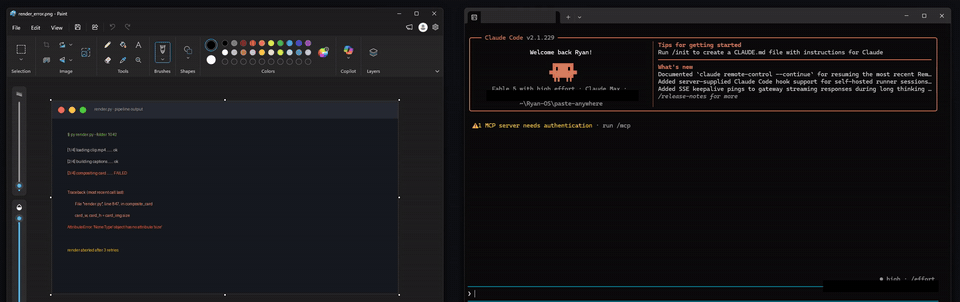

# paste-anywhere

Screenshots, pasteable literally anywhere, including agent terminals.
One snip puts the image, the file, and the path on your clipboard at once.



## The problem

You press Win+Shift+S, snip a screenshot, and switch to your terminal to show it to Claude Code, Codex, or any other coding agent.
Nothing pastes.
The Windows clipboard holds only an image, and a terminal wants text.
So you save the file by hand, find the path, and type it out.
Every single time.

## What this does

A small resident listener watches the clipboard.
When a screenshot lands on it, the bridge saves the image to `Pictures\Clips\clip_<timestamp>.png` and puts it back on the clipboard in every format at once:

| You paste into | You get |
|---|---|
| A terminal / coding agent | The file path as text (agents read the path and open the image) |
| Word, Google Docs, Paint | The image |
| Slack, Discord, Gmail, Explorer | The file |

Each paste target picks the format it prefers.
You never choose, and you never save a file by hand again.

Copies that carry text with them (a snippet from a browser or Word) are left untouched.
The bridge only reacts to pure image copies, which is what a screenshot is.

## Install

Requires Windows 10/11 and Python 3.9+ with two packages:

```
pip install pywin32 Pillow
```

Then clone and register:

```
git clone https://github.com/RyanCollinsAI/paste-anywhere.git
cd paste-anywhere
powershell -ExecutionPolicy Bypass -File register_task.ps1
```

This registers a per-user scheduled task that starts now and at each logon, runs hidden under `pythonw.exe`, and restarts itself if it crashes.
No admin rights needed.

## Uninstall

```
powershell -ExecutionPolicy Bypass -File unregister_task.ps1
```

Your saved clips in `Pictures\Clips` stay.

## Configuration

Set the `PASTE_ANYWHERE_DIR` environment variable to change where clips are saved.
The default is `Pictures\Clips`.

| Variable | Default | Effect |
|---|---|---|
| `PASTE_ANYWHERE_DIR` | `Pictures\Clips` | Where clips are saved. |
| `PASTE_ANYWHERE_MAX_AGE_DAYS` | `30` | Deletes clips older than this many days. The purge runs after a capture, at most once per hour; an idle bridge purges nothing until the next capture. `0` disables. |
| `PASTE_ANYWHERE_MAX_TOTAL_MB` | `2048` | Deletes the oldest clips once the folder passes this size. Same purge timing as above. `0` disables. |
| `PASTE_ANYWHERE_MAX_EDGE` | `1568` | Downscales a captured image proportionally if either edge exceeds this many pixels. `0` disables. |

## How it works

- A hidden window subscribes to `WM_CLIPBOARDUPDATE` via `AddClipboardFormatListener`.
- A clipboard update triggers only when a bitmap is present and no text, file, HTML, or RTF format is - so only real screenshots qualify.
- The image is saved as a PNG, then the clipboard is re-set with `CF_DIB`, a registered `PNG` format, `CF_HDROP`, and `CF_UNICODETEXT` together.
- A custom marker format is written first, so the bridge never reprocesses its own write.
- A clipboard sequence-number check aborts the re-set if you copied something else while the bridge was saving, so it never clobbers a newer copy.
- Activity is logged to `state\bridge.log` next to the script.

## Test it

```
py smoke_test.py
```

Runs an end-to-end check against a fresh bridge instance: trigger, file validity, loop prevention, and two negative cases.
Stop the installed task first (`Stop-ScheduledTask PasteAnywhere`), because the test needs to launch its own instance.

## Maintenance

- `py status.py` (add `--json` for machine-readable output) - reports whether the bridge is running, last capture time, today's capture count, clips folder size, and last error.
- `powershell -ExecutionPolicy Bypass -File diagnose.ps1` - runs an ordered set of health checks and prints the first failure with its fix, or "all checks pass" plus the status line.
- `powershell -ExecutionPolicy Bypass -File update.ps1` - pulls the latest code, re-checks dependencies, restarts the task, and prints the new commit hash.

## License

MIT
